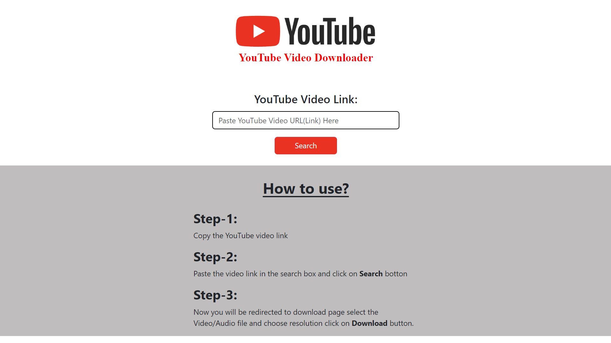
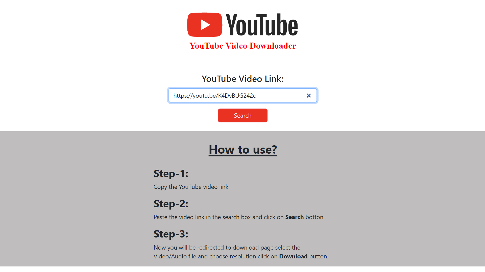
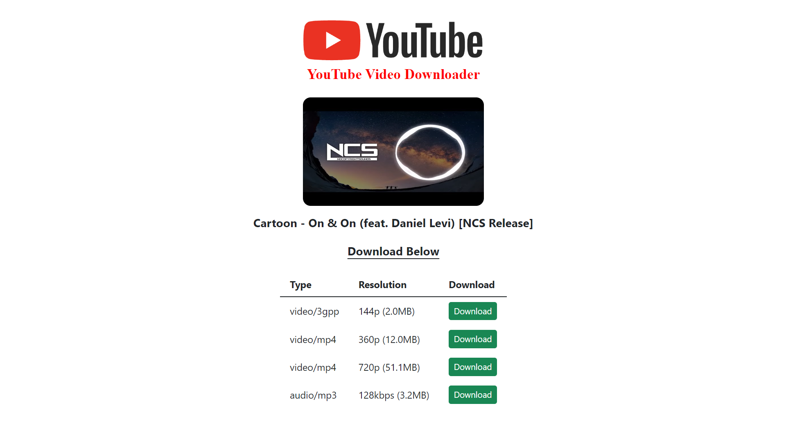

# Django YouTube Video and Audio Downloader on Client-Side

This is a YouTube video and audio downloader web application built using Django and pytube, in this application user can download the YouTube video or audio by pasting the video link in search box. The downloaded file will be saved to the user's device.


## Features

- Download videos in different resolutions
- Download audio
- The file will be downloaded to the client's device


## Screenshots

 

 

 


## Run Locally

Clone the project

```bash
  git clone https://github.com/Shivakumar1V/Django-YouTube-Video-Downloader
```
- Go to the directory where `manage.py` file is available, use `cd` to change the directory 

Install dependencies

```bash
  pip install -r requirements.txt
```

Start the server

```bash
  python manage.py runserver
```

It will run the application on [http://127.0.0.1:8000/](http://127.0.0.1:8000/)

Now the application is ready to use  
Open your browser and go to **[http://127.0.0.1:8000/](http://127.0.0.1:8000/)** 